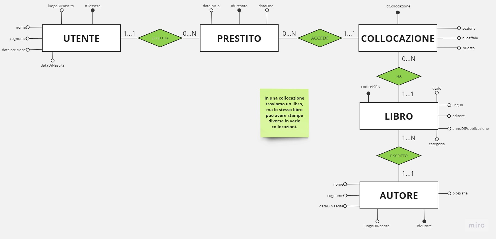

**Schema-E-R-Biblioteca**
Analisi:
Una biblioteca deve gestire tutte le informazioni sui i volumi, utenti e prestiti.
----------------------
Entità che vogliamo utilizzare:
1. Libro: codiceISBN, titolo, lingua, editore, annoDiPubblicazione, categoria;
*CHIAVE*
codiceISBN
2. Autore: nome, cognome, dataDiNascita, luogoDiNascita, biografia, idAutore;
*CHIAVE*
idAutore
3. Collocazione: sezione, nScaffale, nPosto, idCollocazione;
*CHIAVE*
Come chiave candidata abbiamo la chiave composta formata da sezione, nScaffale e nPosto, però sono troppi attributi quindi ho creato un id.
4. Utente: nome, cognome, dataIscrizione, dataDiNascita, luogoDiNascita, nTessera;
*CHIAVE*
nTessera
5. Prestito: dataInizio, dataDiRiconsegna, idPrestito;
*CHIAVE*
idPrestito, perchè una persona può prenotare più volte lo stesso libro nella stessa data.
-----------------------
Esempio:
Bill prende in prestito un libro, e lo tiene per tre giorni. Alla fine del terzo giorno riporta il libro, e il prestito viene terminato.
------------------------
Schema ER:
